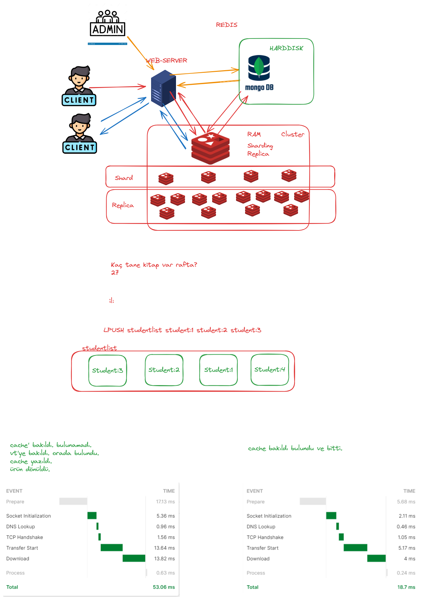

# REDIS-CLI ile çalışmak:
* Terminale aşağıdaki komut yazılarak cli ekranına erişilir.
* redis-redis-1 : buradaki ilk redis ifadesi docker-compose.yml ile containerları oluşturduğumuz için oluşan grubun adıdır.
* redis-1 ifadesi ise container adıdır.

* docker exec -it redis-redis-1 redis-cli
* KEYS * -> redisteki keylerin tamamını döner.
* String, Hash ve List için bazı komutlar denendi.
* Ayrıca buradaki işlemlerin takibi redisinsight bağlantısıyla gözlemlendi.

# DOCKER-COMPOSE DEPENDS ON:

```yml
services:
  web:
    build: .
    depends_on:
      - db
      - redis
  redis:
    image: redis
  db:
    image: postgres
```

